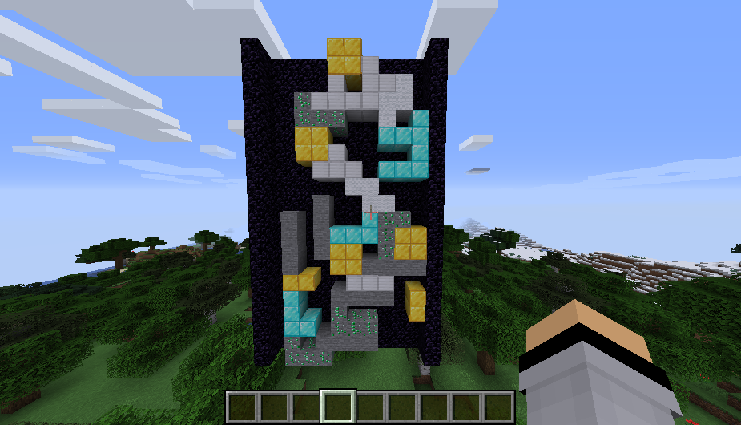

# Tetris

Tetris представляет собой аркадную игру "Тетрис", реализованную на языке Python для среды Minecraft. Оригинальная игра создана в 1985 году Алексеем Пажитновым в Вычислительном центре Академии наук СССР.

## Структура проекта

* server — Директория с ядром локального сервера Minecraft. Содержит предустановленные конфигурации и программные интерфейсы для связи с Python.
* Start_Server.lnk — Файл для быстрого запуска серверной части.
* mcpi — Локальная библиотека API для передачи команд от скрипта к игровому миру.
* TETRIS.py — Основной программный файл, содержащий игровую логику, систему обработки коллизий и генерацию уровней.
* input_system.py — Модуль для обработки нажатий клавиш и управления транспортным средством.
* pinks.txt — Список внешних зависимостей Python.
* LICENSE — Текст лицензионного соглашения.

## Технические требования

* Minecraft Java Edition версии 1.16.5 или выше.
* Python версии 3.7 или выше.
* Операционная система Windows для работы стартового файла сервера.

## Инструкция по запуску

1. Запуск сервера: Откройте файл Start_Server.lnk и дождитесь окончания процесса загрузки мира в консоли.
3. Подключение к игре: Запустите клиент Minecraft и подключитесь к серверу по адресу localhost.
7. Запуск игрового скрипта:
   - Установите зависимости: pip install -r requirements.txt
   -  Запустите скрипт: python race.py
4. Начало игры: После запуска скрипта в мире Minecraft вокруг персонажа будет автоматически выстроена гоночная трасса.

## Харектиристика блоков

* Блоки состоят из:
   - Cветокамня
   - Железа
   - Изумрудной руды
   - Алмазного блока
   - Белой шерсти
   - Золотого блока
   - Камня

## Управление

* Стрелки Вправо/Влево - перемещение по полю
* Сирелка Вверх - вращение блока
